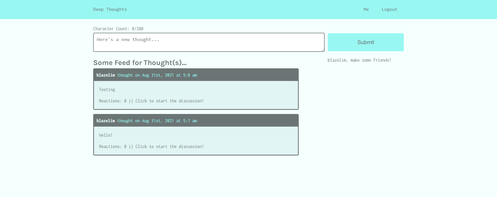

# Deep Thoughts

## Description

Share your thoughts on this handy dandy blogging website. See what your friends are thinking by friending them. Deep Thoughts is a simple blogging website that uses MongoDB to manage thoughts and users and stores them on the MongoDB Atlas cloud database.
## Table of Contents
* [Usage](#usage)
* [License](#license)
* [Questions](#questions)
## Usage
Simply Navigate to the website below

https://majestic-yellowstone-90978.herokuapp.com/

## License
This project is covered under the MIT license.
[Click here to see the terms of the license](https://choosealicense.com/licenses/mit/)
## Questions
Any questions or concerns?
Contact me on my github: [blazelim](https://github.com/blazelim/)

Or email me at: blazebentleycolim@gmail.com